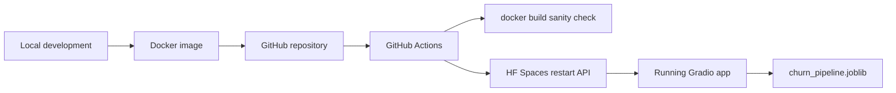

# Customer Churn Prediction — Hugging Face MLOps Deployment

End-to-end MLOps project that packages a trained customer churn classifier, containerizes it with Docker, and deploys it to [Hugging Face Spaces](https://huggingface.co/docs/hub/spaces) with automated CI/CD from GitHub.

## Architecture



| Layer | Technology |
|---|---|
| UI | Gradio (`customer crunch/ui/app.py`) |
| Model | LightGBM / sklearn pipeline (`saved_models/churn_pipeline.joblib`) |
| Container | Docker (Python 3.10-slim) |
| Registry and runtime | Hugging Face Spaces (Docker SDK) |
| CI/CD | GitHub Actions (`.github/workflows/hf_deploy.yml`) |

## Repository layout

```
.
├── Dockerfile                          # HF Space container definition
├── README.md                           # Space metadata + this guide
├── .github/workflows/hf_deploy.yml     # Auto-deploy on push to main
├── customer crunch/
│   ├── ui/app.py                       # Gradio inference UI
│   ├── classification/                 # Training and predict modules
│   ├── saved_models/                   # Serialized model artifacts
│   └── requirements.txt                # Python dependencies
└── scripts/deploy_hf.py                # Optional manual deploy helper
```

## Prerequisites

- Python 3.10+
- Docker Desktop (for local container validation)
- A [Hugging Face account](https://huggingface.co/join) with a **Docker** Space created
- A Hugging Face token with **write** access ([Settings → Access Tokens](https://huggingface.co/settings/tokens))

## 1. Local development (without Docker)

```bash
pip install -r "customer crunch/requirements.txt"
python "customer crunch/ui/app.py"
```

Open http://localhost:7860 and submit a prediction.

## 2. Local Docker validation

Build and run the same image Hugging Face will use:

```bash
docker build -t customer-churn:latest .
docker run --rm -p 7860:7860 customer-churn:latest
```

Open http://localhost:7860. You should see the Gradio UI load and return churn predictions.

Or run the bundled validation script (model load + optional Docker build):

```bash
python scripts/validate_hf_deploy.py
```

Smoke-test the model artifact inside the container:

```bash
docker run --rm customer-churn:latest python -c "
import joblib, os
path = 'customer_crunch/saved_models/churn_pipeline.joblib'
assert os.path.exists(path), f'Missing {path}'
joblib.load(path)
print('Model loaded OK')
"
```

## 3. Hugging Face Space setup

1. Create a new Space at https://huggingface.co/new-space
   - **SDK:** Docker
   - **Hardware:** CPU basic (sufficient for inference)
2. Connect the Space to this GitHub repository (recommended), or push this repo to the Space repo directly.
3. Ensure `saved_models/churn_pipeline.joblib` is committed — the app cannot run without it.

## 4. GitHub Actions CI/CD

Every push to `main` (or a manual workflow run) will:

1. Build the Docker image to verify the Dockerfile.
2. Call the Hugging Face Spaces restart API so the Space rebuilds from the latest commit.

### Required secrets and variables

Go to **GitHub → Repository → Settings → Secrets and variables → Actions**.

| Name | Type | Description |
|---|---|---|
| `HF_SPACE_DEPLOY_TOKEN` | Secret | Hugging Face token with write access |
| `HF_SPACE_ID` | Variable (or secret) | Your Space id, e.g. `your-username/customer-churn` |

If the Space is linked to GitHub, HF rebuilds automatically on push; the restart step ensures a fresh build even when only model files change.

### Manual workflow trigger

**Actions → Deploy to Hugging Face Spaces → Run workflow**

## 5. Cloud validation

After deployment, open your Space URL:

```
https://huggingface.co/spaces/<HF_SPACE_ID>
```

Verify:

- The Gradio UI loads without a "Model failed to load" error.
- Default inputs return a **Churn Prediction Status** and **Churn Probability**.
- Space **Logs** tab shows no traceback on startup.

## Optional: Streamlit SaaS app

A richer Streamlit version with macro forecasting lives in `customer crunch/customer_churn_saas/`. Deploy it manually:

```bash
export HF_TOKEN=hf_...
python scripts/deploy_hf.py
```

See `customer crunch/customer_churn_saas/README.md` for details.

## Project outcomes (HF adaptation)

| Outcome | How this repo addresses it |
|---|---|
| MLOps deployment workflow | GitHub → Docker build → HF Spaces |
| Containerize ML locally | Root `Dockerfile` + local `docker run` |
| Automated Docker image | GitHub Actions builds on every push |
| Version-controlled deployments | Git commits trigger rebuilds |
| Validate locally and in cloud | Gradio UI on localhost:7860 and HF Space URL |
| Monitoring | HF Space Logs + container health in Space settings |
| **Advisor Agent** | Chat tab — predict churn and retention tips from natural commands |
| **MLOps Agent** | Drift scan (KS test) + self-healing retrain; weekly GitHub Action |

## Troubleshooting

| Symptom | Fix |
|---|---|
| `Model failed to load` | Confirm `customer crunch/saved_models/churn_pipeline.joblib` exists and is tracked in git |
| Docker build fails on path with space | The Dockerfile quotes `"customer crunch/..."`; build from repo root |
| CI restart fails with 401 | Regenerate `HF_SPACE_DEPLOY_TOKEN` with write scope |
| `ImportError: HfFolder` on Space startup | Use Gradio 5.x (see `requirements.txt`) |
| `TypeError: unhashable type: 'dict'` | Pin `starlette>=0.40.0,<0.46.0` with Gradio |
| `localhost is not accessible` on Space | App uses `root_path=os.getenv("SPACE_URL_PATH")` |
| CI restart fails with 404 | Check `HF_SPACE_ID` matches your Space exactly |

## Cleanup

Delete or pause the Hugging Face Space when you are done to avoid unnecessary usage. Remove the GitHub secret if the pipeline is no longer needed.
